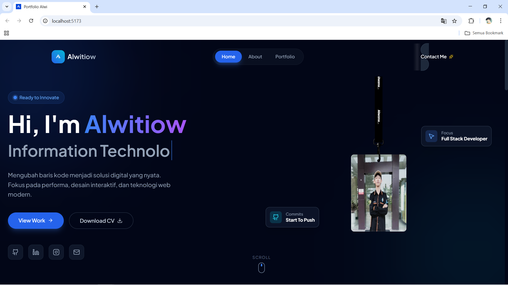

# 🌐 Alwznx Portfolio - Interactive 3D Web Experience


> **Website portofolio interaktif berbasis React & Three.js yang menggabungkan desain Glassmorphism, animasi fisika 3D, dan integrasi backend realtime.**

<div align="center">
  
</div>

🔗 **Live Demo:** [https://portfolio-kamu.vercel.app](https://portfolio-kamu.vercel.app)

---

## ✨ Fitur Unggulan

Project ini bukan sekadar halaman statis. Saya mengimplementasikan berbagai teknologi modern untuk menciptakan pengalaman pengguna yang imersif:

### 🎮 3D Interactive Lanyard (Physics Simulation)
Fitur *hero section* yang menampilkan kartu identitas 3D dengan simulasi fisika nyata.
- **Teknologi:** `@react-three/fiber`, `@react-three/drei`, `@react-three/rapier` (Physics Engine), `meshline`.
- **Interaksi:** Kartu dapat ditarik, diayunkan, dan berbenturan secara realistis menggunakan mouse/touch.
- **Procedural & Asset Based:** Menggabungkan model 3D custom (`.glb`) dengan tekstur dinamis.

### 💬 Realtime Guestbook
Buku tamu interaktif di mana pengunjung bisa meninggalkan pesan yang muncul secara *realtime* tanpa refresh halaman.
- **Backend:** Supabase (PostgreSQL).
- **Fitur:** Realtime subscription, Avatar generator otomatis berdasarkan nama.

### 🏆 Certificate Preview System
Sistem galeri sertifikat dengan fitur preview modal tanpa harus mendownload file terlebih dahulu.
- **Dukungan:** Preview gambar berkualitas tinggi + Opsi download file asli (PDF).
- **Showcase:** Menampilkan HKI (Hak Kekayaan Intelektual) EduReflect dan sertifikat kompetensi lainnya.

### 🎨 Modern UI/UX
- **Glassmorphism:** Efek blur dan transparansi modern menggunakan Tailwind CSS.
- **Animations:** Transisi halaman yang mulus dan *scroll reveal* menggunakan `Framer Motion`.
- **Responsive:** Tampilan optimal di Desktop, Tablet, dan Mobile.

---

## 🛠️ Tech Stack

**Core:**
* **Frontend Framework:** [React.js](https://reactjs.org/) (Vite)
* **Styling:** [Tailwind CSS](https://tailwindcss.com/)
* **Animations:** [Framer Motion](https://www.framer.com/motion/)
* **Icons:** [Lucide React](https://lucide.dev/) & [React Icons](https://react-icons.github.io/react-icons/)

**3D & Physics:**
* **Three.js Ecosystem:** Three.js, React Three Fiber (R3F), Drei
* **Physics Engine:** Rapier (via `@react-three/rapier`)
* **Geometry:** Meshline (untuk simulasi tali lanyard)

**Backend & Data:**
* **Database:** [Supabase](https://supabase.com/) (PostgreSQL)
* **Deployment:** [Vercel](https://vercel.com/)

---

## 📂 Struktur Project

```bash
src/
├── assets/             # Gambar, Model 3D (.glb), Sertifikat (.pdf)
│   ├── cert/           # File sertifikat (HKI, English, dll)
│   ├── porto/          # Screenshot project
│   └── ...
├── components/         # Komponen UI (Navbar, PhysicsLanyard, dll)
├── pages/              # Halaman Utama (Home, About, Portfolio, Contact)
├── lib/                # Konfigurasi Supabase Client
├── App.jsx             # Main Router & Layout
└── main.jsx            # Entry Point

```

---

## 🚀 Cara Menjalankan di Lokal

Ingin mencoba kode ini di komputer Anda? Ikuti langkah berikut:

1. **Clone Repository**
```bash
git clone [https://github.com/alwznx/portfolio-alwi.git](https://github.com/alwznx/portfolio-alwi.git)
cd portfolio-alwi

```


2. **Install Dependencies**
Pastikan Node.js sudah terinstall.
```bash
npm install

```


3. **Setup Environment Variables (Supabase)**
Buat file `.env` di root folder dan masukkan API Key Supabase Anda (diperlukan untuk fitur Guestbook):
```env
VITE_SUPABASE_URL=your_supabase_url
VITE_SUPABASE_ANON_KEY=your_supabase_anon_key

```


4. **Jalankan Development Server**
```bash
npm run dev

```


Buka `http://localhost:5173` di browser Anda.

---

## 🖼️ Project Showcase

Portofolio ini memuat beberapa proyek unggulan saya, antara lain:

1. **EduReflect** (HKI Registered) - Platform evaluasi pembelajaran.
2. **Perpustakaan Digital** - Sistem manajemen buku berbasis Laravel.
3. **AI Face Attendance** - Sistem absensi biometrik Python.
4. **JokiGame Manager** - Aplikasi desktop manajemen transaksi (Java).

---

## 👨‍💻 Author

**Ahmad Alwi Tio Wicaksono**
*Information Technology Education Student @ Universitas Negeri Surabaya*

Tertarik berkolaborasi atau ingin menyapa? Hubungi saya melalui form kontak di website atau sosial media di bawah.

---

Created with 💙 and lots of coffee code by **Alwznx**.